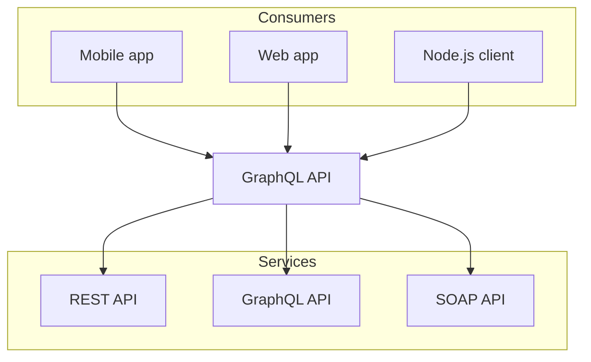

# Welcome to Nextra and Frank Folder
 
Hello, world!

# Introduction Frank Page
 
Welcome to Nextra Frank Page! This is a basic docs template. You can use it as a starting point for your own project :)

## What is Nextra Frank Page?

A **simple**, **powerful** and **flexible** site generation framework with everything you love from Next.js.

## Documentation Frank Page 1

The documentation is available at [https://nextra.site](https://nextra.site).
 
Hello, world!

## Documentation Frank Page 2

The documentation is available at [https://nextra.site](https://nextra.site).
 
Hello, world!

## Documentation Frank Page 3

The documentation is available at [https://nextra.site](https://nextra.site).
 
Hello, world!

## Documentation Frank Page 4

The documentation is available at [https://nextra.site](https://nextra.site).
 
Hello, world!

## Documentation Frank Page 5

The documentation is available at [https://nextra.site](https://nextra.site).
 
Hello, world!

